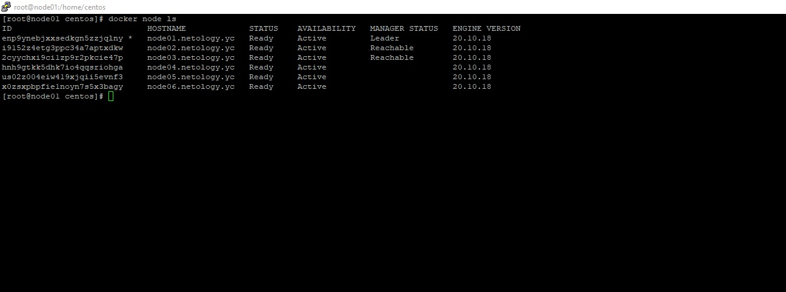
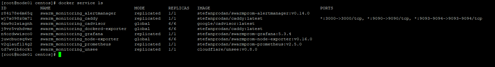

# Домашнее задание к занятию "5.5. Оркестрация кластером Docker контейнеров на примере Docker Swarm"

## Задача 1

Дайте письменые ответы на следующие вопросы:

- В чём отличие режимов работы сервисов в Docker Swarm кластере: replication и global?
- Какой алгоритм выбора лидера используется в Docker Swarm кластере?
- Что такое Overlay Network?

#### Ответ
- В режиме global сервис запустится на всех нодах кластера, в режим replication зависит от того, сколько реплик указано нативно
- Протокол Raft
- Это служебная сеть кластера для обмена между нодами, работаюшая поверх текущего транспорта


## Задача 2

Создать ваш первый Docker Swarm кластер в Яндекс.Облаке

Для получения зачета, вам необходимо предоставить скриншот из терминала (консоли), с выводом команды:
```
docker node ls
```
#### Ответ

<p align="center">
  
</p>


## Задача 3

Создать ваш первый, готовый к боевой эксплуатации кластер мониторинга, состоящий из стека микросервисов.

Для получения зачета, вам необходимо предоставить скриншот из терминала (консоли), с выводом команды:
```
docker service ls
```
#### Ответ

<p align="center">
  
</p>

## Задача 4 (*)

Выполнить на лидере Docker Swarm кластера команду (указанную ниже) и дать письменное описание её функционала, что она делает и зачем она нужна:
```
# см.документацию: https://docs.docker.com/engine/swarm/swarm_manager_locking/
docker swarm update --autolock=true
```

#### Ответ
Данный функционал является дополнительной защитой от компрометации или перехвата ключевой информации при обмене между нодами либо при доступе к журналам RAFT. Данная команда дополнительно шифрует оба ключа (и ключ, используемый для шифрования связи между нодами, и ключ, которым шифруются журналы RAFT локально).
После запуска данной команды и перезапуска демона докера требуется дополнительно разблокировать конфигурацию ключом, сгенерированным при шифровании.

Пример на лидере кластера в моем облаке:
````bash
[root@node01 centos]# docker swarm update --autolock=true
Swarm updated.
[root@node01 centos]#
[root@node01 centos]# systemctl restart docker
[root@node01 centos]#
[root@node01 centos]# docker node ls
Error response from daemon: Swarm is encrypted and needs to be unlocked before it can be used. Please use "docker swarm unlock" to unlock it.
[root@node01 centos]#
[root@node01 centos]# docker swarm unlock
Please enter unlock key:
[root@node01 centos]#
[root@node01 centos]# docker node ls
ID                            HOSTNAME             STATUS    AVAILABILITY   MANAGER STATUS   ENGINE VERSION
enp9ynebjxxsedkgn5zzjqlny *   node01.netology.yc   Ready     Active         Reachable        20.10.18
i9152z4etg3ppc34a7aptxdkw     node02.netology.yc   Ready     Active         Reachable        20.10.18
2cyychxi9ci1zp9r2pkcie47p     node03.netology.yc   Ready     Active         Leader           20.10.18
hnh9gtkk5dhk7io4qqsriohga     node04.netology.yc   Ready     Active                          20.10.18
us02z004eiw419xjqii5evnf3     node05.netology.yc   Ready     Active                          20.10.18
x0zsxpbpfie1noyn7s5x3bagy     node06.netology.yc   Ready     Active                          20.10.18


````


---

### Как cдавать задание

Выполненное домашнее задание пришлите ссылкой на .md-файл в вашем репозитории.

---
